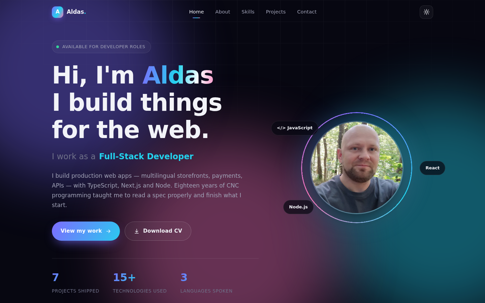
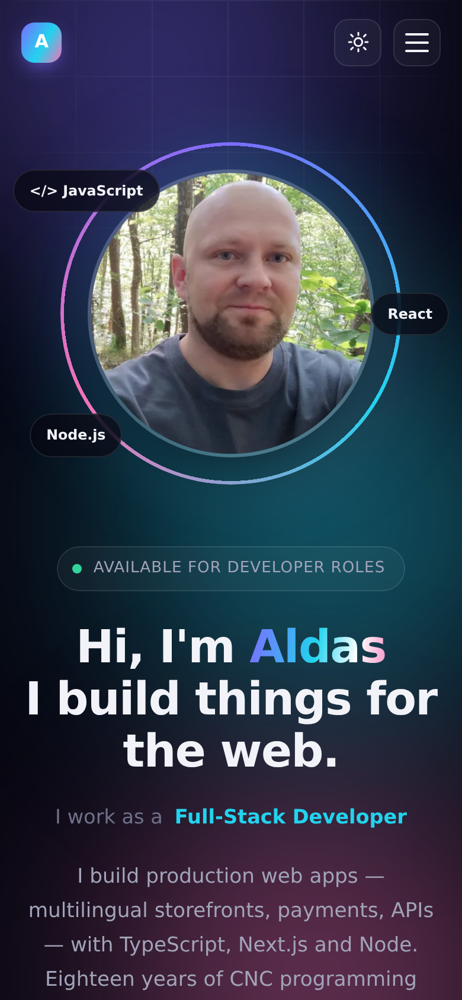
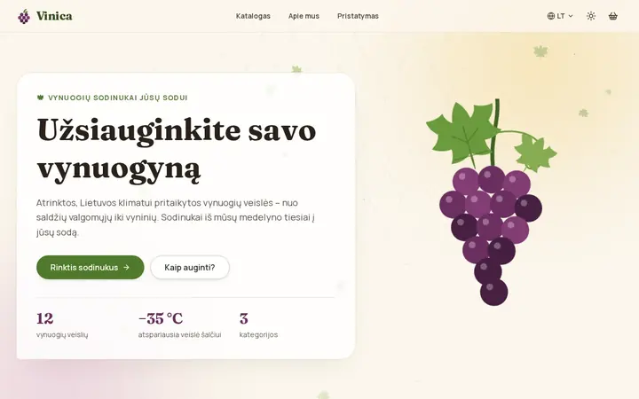
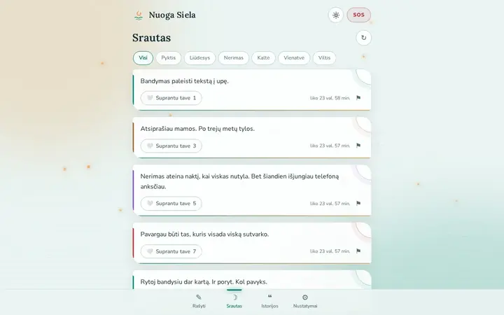
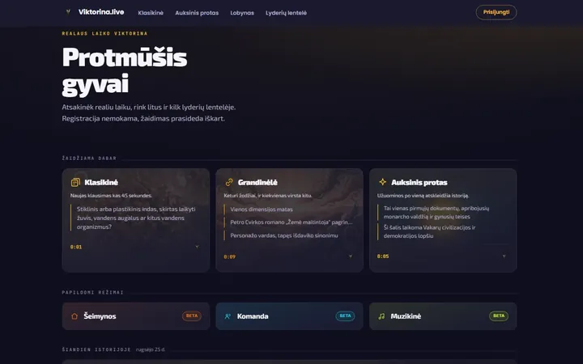
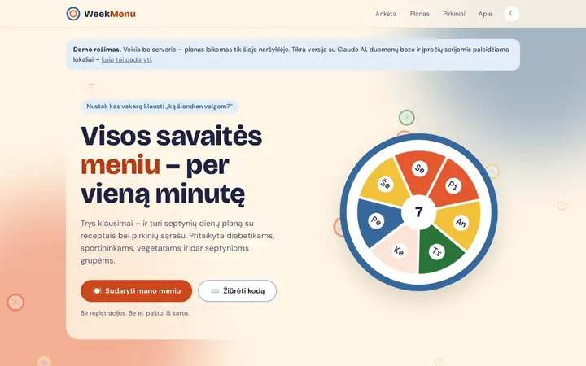

**English** · [Lietuvių](README.lt.md)

# 👋 Aldas Kšečkauskas — Portfolio

Full-stack web developer building with TypeScript, Next.js and Node.
This repo is my portfolio site: who I am, what I build and how to reach me.
Plain HTML, CSS and JavaScript — no frameworks and no build step.

<p>


</p>

[](https://aldas-portfolio.site)



<p align="center">
  
</p>

## 🚀 Featured projects

<table>
  <tr>
    <td width="50%" valign="top">
      <a href="https://vinica-grape-shop.vercel.app"></a>
      <h3>Vinica</h3>
      <p>A four-language online store for grapevine seedlings, with Stripe checkout and an admin panel.</p>
      <p><sub>Next.js · TypeScript · Prisma · PostgreSQL · Stripe</sub></p>
      <p><a href="https://vinica-grape-shop.vercel.app">Live</a> · <a href="https://github.com/brutall100/vinica-grape-shop">Code</a></p>
    </td>
    <td width="50%" valign="top">
      <a href="https://nuogasiela.lt"></a>
      <h3>Nuoga Siela</h3>
      <p>An anonymous space to write out what you feel — burn it or release it. A zero-dependency PWA.</p>
      <p><sub>Deno · Deno KV · TypeScript · PWA</sub></p>
      <p><a href="https://nuogasiela.lt">Live</a> · <a href="https://github.com/brutall100/nuoga-siela">Code</a></p>
    </td>
  </tr>
  <tr>
    <td width="50%" valign="top">
      <a href="https://www.viktorina.live"></a>
      <h3>Viktorina.live</h3>
      <p>A live pub-quiz platform: join a game in real time, climb the leaderboard, earn credits.</p>
      <p><sub>JavaScript · Node.js · Real-time</sub></p>
      <p><a href="https://www.viktorina.live">Live</a></p>
    </td>
    <td width="50%" valign="top">
      <a href="https://weekmenu.brutall100.deno.net"></a>
      <h3>WeekMenu</h3>
      <p>An AI meal planner: a week’s menu with recipes and a shopping list, tailored to ten diets.</p>
      <p><sub>Deno · Fresh · Preact · Claude API · Tailwind</sub></p>
      <p><a href="https://weekmenu.brutall100.deno.net">Live</a> · <a href="https://github.com/brutall100/weekmenu-ai-meal-planner">Code</a></p>
    </td>
  </tr>
</table>

More projects on the [website](https://aldas-portfolio.site/#projects).

## About this site

| | |
| --- | --- |
| **Layout** | CSS Grid + Flexbox, fluid `clamp()` type, mobile-first breakpoints |
| **Theming** | CSS custom properties, dark default + light toggle saved to `localStorage`; project screenshots swap with the theme |
| **Motion** | `IntersectionObserver` scroll reveals, shimmer sweeps, animated aurora background |
| **A11y** | Skip link, focus-visible rings, ARIA state on the menu/toggle, `prefers-reduced-motion` support |
| **Perf** | Optimised WebP images, lazy loading, explicit dimensions, zero JS dependencies |

## Run it locally

Start any static server, e.g. `python3 -m http.server`, then open
<http://localhost:8000>.

```
index.html    markup and content
style.css     design tokens, layout, animations
script.js     theme, menu, scroll reveal, progress bar, space quote
about-viz.js  the small animated scenes on the About cards
img/          profile photo; img/projects/ has light + dark project shots
docs/         README screenshots
```

## Deploying

GitHub Pages serves the site from `main`, so a push to `main` is the deploy.
`CNAME` holds the custom domain and `_config.yml` keeps `cv/`, `docs/`, the
READMEs and `.htaccess` off the published site. `.htaccess` is only for
Apache hosting.

## Contact

- **Email**: aldas.kse@gmail.com
- **LinkedIn**: [aldas-kseckauskas](https://www.linkedin.com/in/aldas-kseckauskas)

## License

[MIT](LICENSE) © Aldas Kšečkauskas
